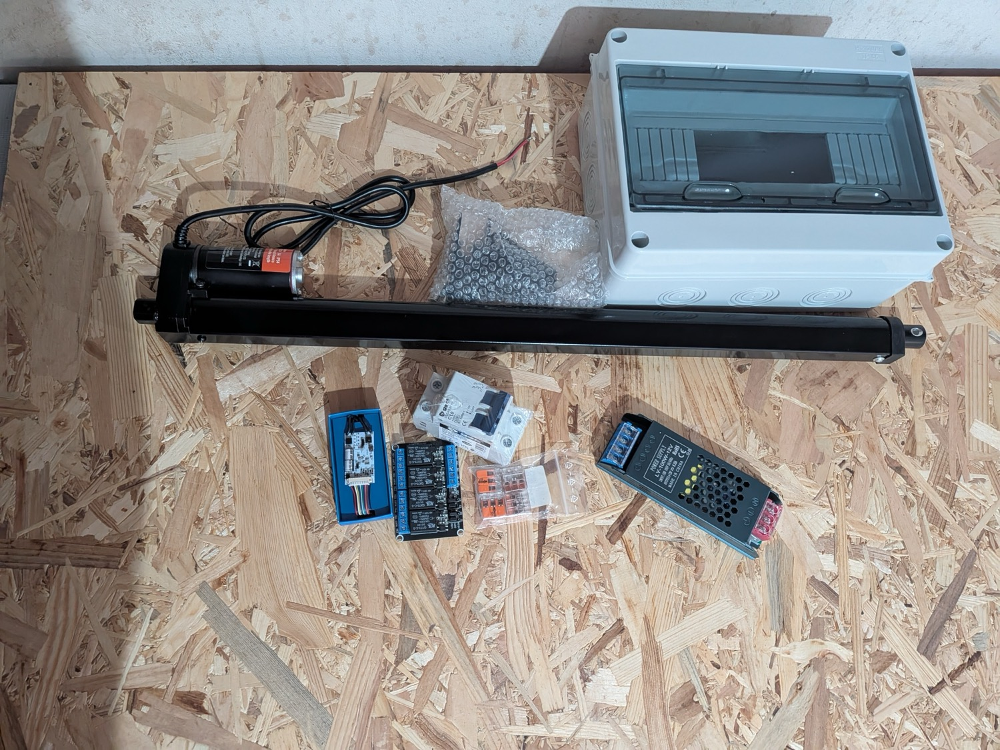
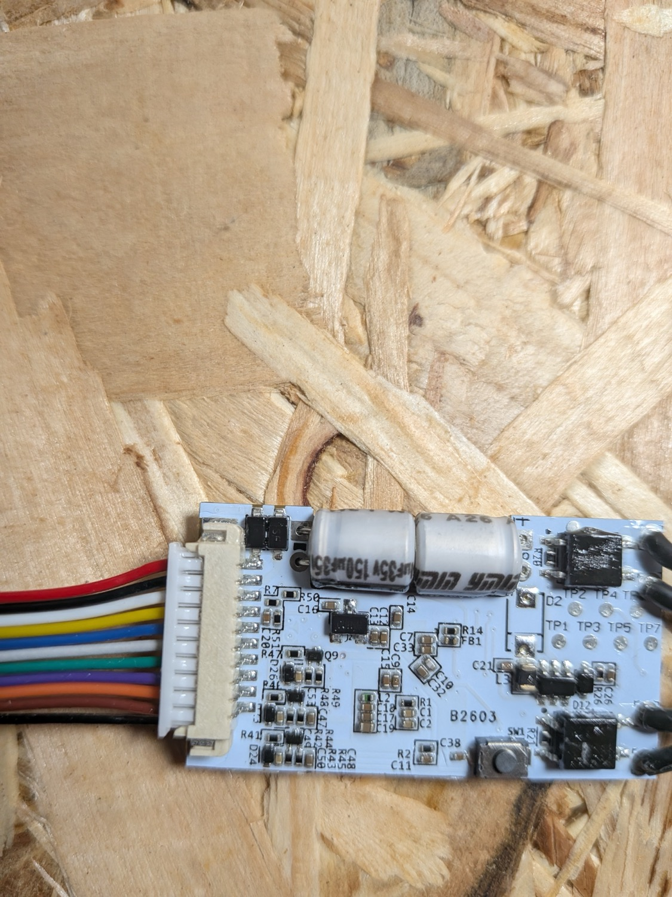
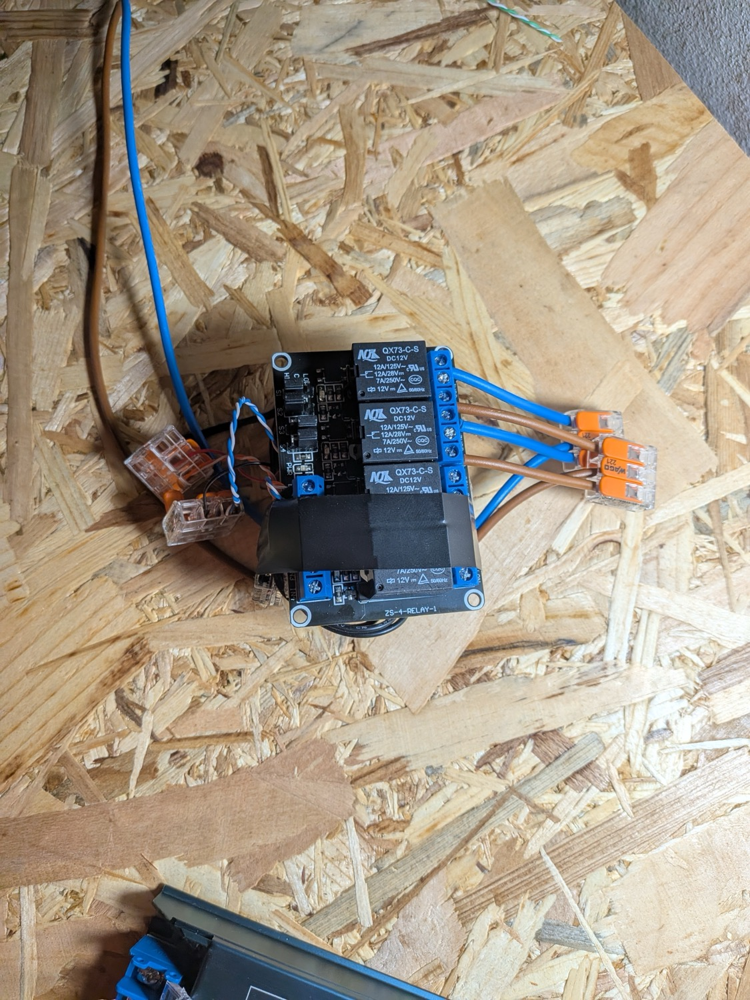
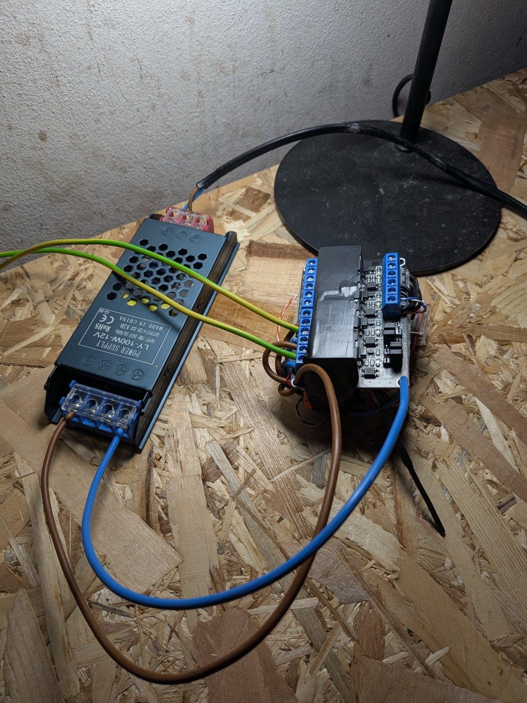
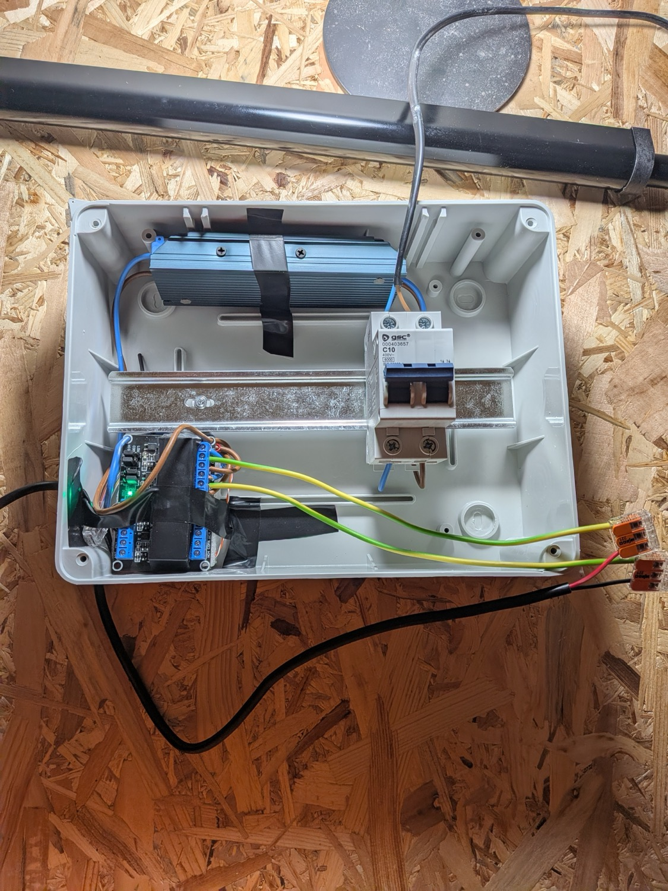
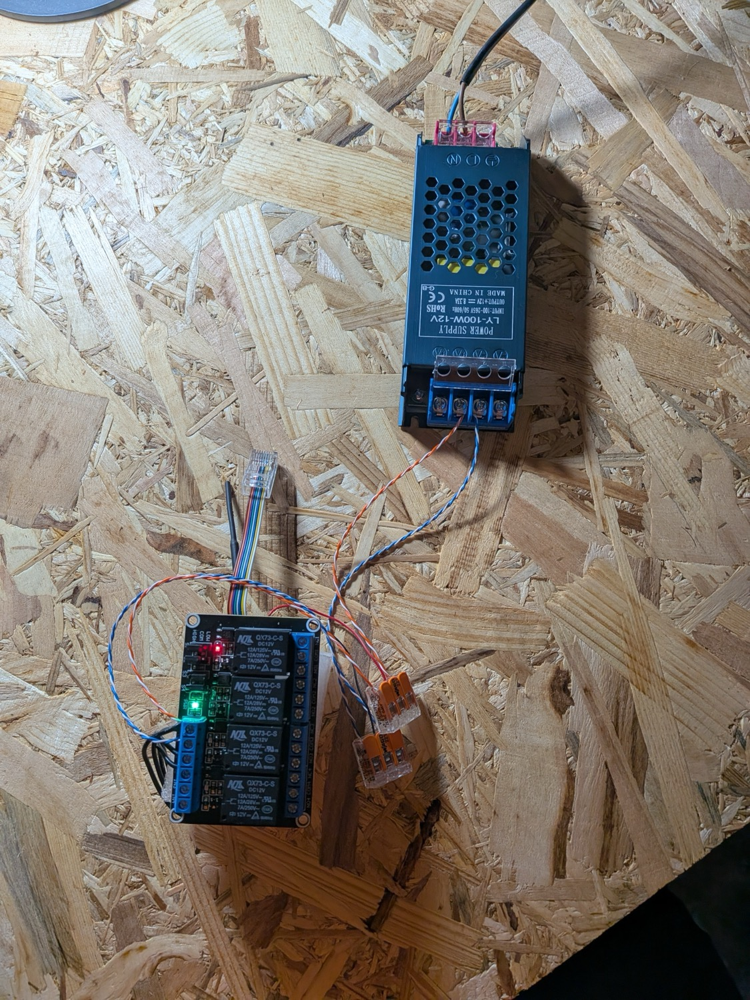
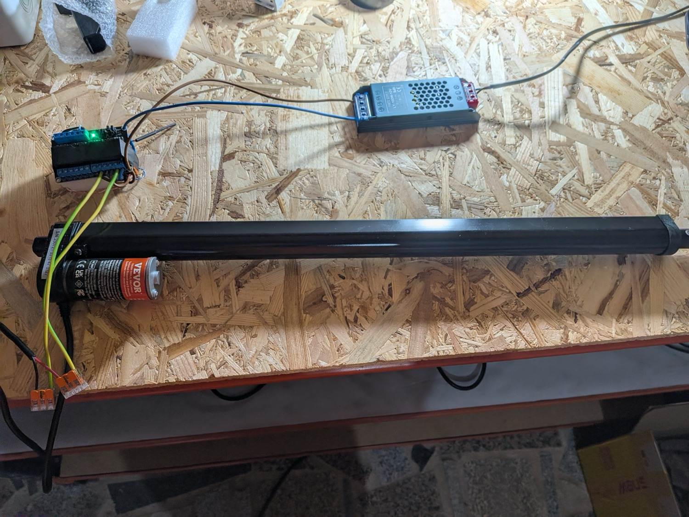

# Build

## Control box

Everything that switches the door, assembled and tested on the bench before it went
anywhere near the coop.

### Parts

The whole build laid out. Actuator, IP65 enclosure, power supply, relay board, breaker,
Shelly and a bag of WAGO connectors.

The Shelly Plus Uni out of its sleeve. The coloured harness is how every terminal is
reached, so the wire colours are the terminal names.

### Assembly

Shelly taped under the relay board and wired to it. Keeping the pair together makes one
unit to mount instead of two.

Power supply joined to the relay board, with earth landed on the supply and nothing
downstream of it.

Dry fit in the IP65 box. The breaker clips to the DIN rail. The power supply and the
Shelly and relay pair are taped to the backplate, because neither is DIN mountable.

### Bench testing

Relay board powered and switching. The lit channel is the one being driven.

Actuator on the bench, driven through the relays, running its full 500 mm travel in both
directions before anything was mounted.

## Door and rails

Being made at a metal shop. Aluminium panel 45 cm high by 50 cm wide in 2.5 mm sheet, and
two Z profile rails 900 mm long.

Nothing is fitted yet. Photos of fabrication, fitting and the install on the coop go here.
