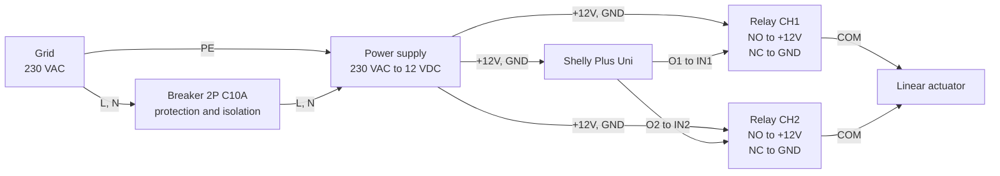
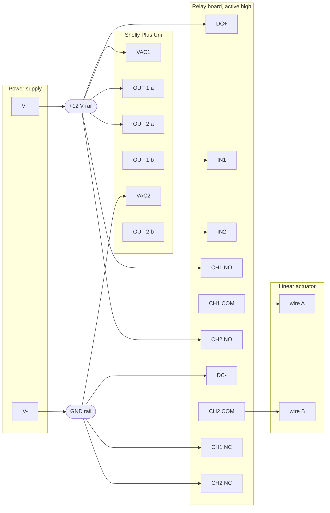

# Wiring

## Overview

## Detailed wiring

The 12 V side, terminal to terminal, starting at the supply output. Everything upstream of
V+ and V- is in the overview. Shelly markings are the ones printed on its leads.

## Unused terminals

Nothing connects to the Shelly's `+5 VDC`, `GND`, `IN1`, `IN2`, `ANALOG IN`, `COUNT IN`,
`DATA` or `SENSOR VCC`. Channels 3 and 4 of the relay board are spare.

The two digital inputs staying free is what leaves room for door position sensing later.

## Motor states

The two relays reverse polarity across the motor.

| CH1 | CH2 | Motor A | Motor B | Result |
|----|----|---------|---------|--------|
| off | off | GND | GND | stopped |
| on | off | +12V | GND | travels one way |
| off | on | GND | +12V | travels the other way |
| on | on | +12V | +12V | stopped |

No combination connects +12 V to GND, so no state shorts the supply. Which relay opens
the door depends on how the motor leads land on the commons, so confirm it on the bench
before fitting.

## Limit switches

The actuator carries its own end of travel switches. They sit inside the body and cut the
motor when the shaft reaches either end of its 500 mm stroke.

No external end stop sensor is fitted, and this is deliberate. Stopping the motor is a
job for the mechanism, not for a script. A software end stop fails when the Shelly loses
power, reboots mid travel, or runs a schedule it should not, and the actuator then drives
itself into its own frame.

**This is a hard requirement.** Any actuator used in this build has integrated limit
switches.

What the switches do not do is report anything. They act on the motor alone, so the
Shelly cannot tell from them whether the door is open, shut, or stopped halfway on an
obstruction.

## Notes

- Earth reaches the power supply input and stops there. Everything downstream is 12 V
  with no earth.
- Relay inputs are active high.
- The breaker is the only protective device in the build.
